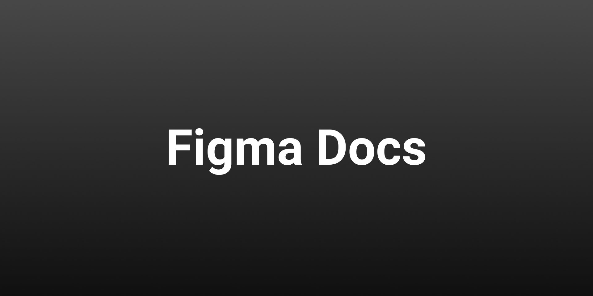

# Figma Publish Plugin Template

## Icon

## Name

Figma Docs

## Description

Quickly create documentation for all your figma styles.

_Alpha Release_
This is an alpha (pre-stable) release. Please submit any issues as well as feature requests to the [Github repo](https://github.com/rttnbrgr/harmony)

## Cover Art

## Tags

#documentation, #styles, #colorStyles, #textStyles, #effectStyles, #harmony

## Support Contact

https://github.com/rttnbrgr/harmony

## Creator(s)

## Version Notes

0.0.1 - Initial alpha release
0.0.2 - Updates to address async text loading issues
